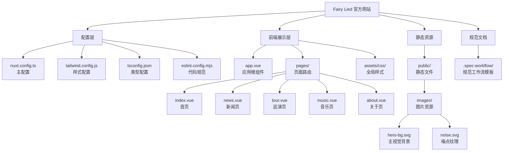

# Fairy Lied 官方网站 - 项目文档

> Fairy Lied（妖精说了谎）是一支中国哥特金属、交响金属和力量金属乐队的官方网站。

---

## 项目愿景

打造一个视觉震撼、交互流畅的乐队官方网站，展现 Fairy Lied 独特的音乐风格和艺术气质。网站融合哥特金属的黑暗美学与现代前端技术，为粉丝提供沉浸式的浏览体验。

## 架构总览

本项目采用 **Nuxt 3 + Vue 3 + TypeScript** 技术栈，结合 Tailwind CSS 和 Nuxt UI 组件库构建。采用服务端渲染(SSR)架构，确保首屏加载速度和 SEO 优化。



---

## 模块索引

| 模块 | 路径 | 职责描述 |
|------|------|----------|
| **pages** | [`./pages/`](./pages/) | 页面路由组件，包含首页、新闻、巡演、音乐、关于等页面 |
| **assets** | [`./assets/`](./assets/) | 静态资源，包含全局 CSS 样式文件 |
| **public** | [`./public/`](./public/) | 公开静态资源，包含图片、favicon、robots.txt 等 |
| **server** | [`./server/`](./server/) | 服务端代码目录（当前为 Nuxt 默认配置） |
| **.spec-workflow** | [`./.spec-workflow/`](./.spec-workflow/) | 规范工作流模板目录 |

---

## 技术栈

### 核心框架
- **Nuxt 3** - 全栈 Vue 框架，支持 SSR/SSG
- **Vue 3** - 渐进式 JavaScript 框架
- **TypeScript** - 类型安全的 JavaScript 超集

### 样式与 UI
- **Tailwind CSS** - 原子化 CSS 框架
- **Nuxt UI** - 基于 Tailwind 的 Vue 组件库
- **Google Fonts** - Cinzel、Roboto、Noto Sans SC 字体

### 开发工具
- **pnpm** - 高效的包管理器
- **ESLint** - 代码质量检查
- **Vite** - 快速的开发构建工具（Nuxt 内置）

---

## 运行与开发

### 环境要求
- Node.js 18+
- pnpm 8.15.4+

### 安装依赖
```bash
pnpm install
```

### 启动开发服务器
```bash
pnpm dev
```
开发服务器将在 `http://localhost:3000` 启动。

### 构建生产版本
```bash
pnpm build
```

### 静态生成
```bash
pnpm generate
```

### 预览生产构建
```bash
pnpm preview
```

---

## 项目结构

```
fairy-lied_offical-website/
├── app.vue                    # 应用根组件（包含全局布局、导航、页脚）
├── nuxt.config.ts             # Nuxt 配置文件
├── tailwind.config.js         # Tailwind CSS 配置
├── tsconfig.json              # TypeScript 配置
├── eslint.config.mjs          # ESLint 配置
├── package.json               # 项目依赖与脚本
├── pnpm-lock.yaml             # pnpm 锁定文件
├── assets/
│   └── css/
│       └── main.css           # 全局样式、CSS 变量、动画
├── pages/                     # 文件系统路由
│   ├── index.vue              # 首页（乐队展示、新闻、音乐、视频、评价）
│   ├── news.vue               # 新闻动态页
│   ├── tour.vue               # 巡演日程页
│   ├── music.vue              # 音乐作品页
│   └── about.vue              # 关于我们页
├── public/                    # 静态资源（直接复制到输出目录）
│   ├── favicon.ico
│   ├── robots.txt
│   └── images/
│       ├── hero-bg.svg        # 首页 Hero 背景
│       └── noise.svg          # 噪点纹理
├── server/                    # 服务端代码
│   └── tsconfig.json
└── .spec-workflow/            # 规范工作流模板
    ├── user-templates/
    └── templates/
```

---

## 测试策略

### 当前状态
本项目目前为展示型网站，暂无自动化测试。建议后续添加：

1. **单元测试** - 使用 Vitest 测试工具函数和 composables
2. **组件测试** - 使用 Vue Test Utils 测试 Vue 组件
3. **E2E 测试** - 使用 Playwright 测试关键用户流程

### 测试目录规划
```
tests/
├── unit/                      # 单元测试
├── component/                 # 组件测试
└── e2e/                       # 端到端测试
```

---

## 编码规范

### Vue 文件组织
```vue
<script setup lang="ts">
// 1. 导入/依赖
// 2. 类型定义
// 3. 响应式数据
// 4. 计算属性
// 5. 方法/函数
// 6. 生命周期钩子
</script>

<template>
  <!-- 模板内容 -->
</template>

<style scoped>
/* 组件级样式 */
</style>
```

### 命名规范
- **Vue 文件**: PascalCase (如 `NewsCard.vue`)
- **TypeScript 文件**: camelCase (如 `useMusic.ts`)
- **CSS 类名**: kebab-case (如 `glass-effect`)
- **常量**: UPPER_SNAKE_CASE

### Tailwind 使用原则
1. 优先使用 Tailwind 原子类
2. 复杂样式抽取到 `main.css` 的自定义类中
3. 使用 CSS 变量管理主题色

---

## AI 使用指引

### 修改页面内容
- 页面组件位于 `pages/` 目录
- 数据硬编码在 `<script setup>` 中，直接修改数组即可
- 样式通过 Tailwind 类名和 `assets/css/main.css` 中的自定义类控制

### 添加新页面
1. 在 `pages/` 下创建 `.vue` 文件
2. 文件名将自动成为路由路径
3. 参考现有页面结构，使用 `<UContainer>` 作为内容容器

### 修改全局样式
- 颜色变量定义在 `assets/css/main.css` 的 `:root` 中
- 自定义动画和效果也在 `main.css` 中定义
- Tailwind 配置在 `tailwind.config.js` 中扩展主题

### 修改导航和页脚
- 全局布局在 `app.vue` 中
- 导航链接硬编码在模板中
- 社交媒体链接和页脚链接在 `<script setup>` 的数组中定义

---

## 变更记录 (Changelog)

### 2026-03-07 - 架构文档初始化
- 创建根级 CLAUDE.md 文档
- 扫描项目结构，识别所有模块
- 生成模块索引和 Mermaid 结构图

---

## 覆盖率报告

| 类别 | 文件数 | 已扫描 | 覆盖率 |
|------|--------|--------|--------|
| 配置文件 | 5 | 5 | 100% |
| 页面组件 | 5 | 5 | 100% |
| 样式文件 | 1 | 1 | 100% |
| 静态资源 | 3 | 3 | 100% |
| **总计** | **14** | **14** | **100%** |

### 缺口清单
- 无重大缺口，项目结构完整
- 建议后续补充：components/ 目录、composables/ 目录、tests/ 目录

### 忽略的目录
- `node_modules/` - 依赖目录
- `.nuxt/` - Nuxt 构建输出
- `.output/` - 生产构建输出
- `images/` - 生成的临时图片

---

*文档生成时间: 2026-03-07 15:54:31*
