# Fairy Lied 官方网站 - 项目文档

> Fairy Lied（妖精说了谎）是一支中国哥特金属、交响金属和力量金属乐队的官方网站。

---

## 项目愿景

打造一个视觉震撼、交互流畅的乐队官方网站，展现 Fairy Lied 独特的音乐风格和艺术气质。网站融合哥特金属的黑暗美学与现代前端技术，为粉丝提供沉浸式的浏览体验。

## 架构总览

本项目采用 **Nuxt 3 + Vue 3 + TypeScript** 全栈技术栈，结合 Tailwind CSS、Nuxt UI 和 SQLite 数据库构建。采用服务端渲染(SSR)架构，支持动态数据管理和完整的后台管理系统。

```mermaid
graph TD
    Root["Fairy Lied 官方网站"] --> Config["配置层"]
    Root --> Frontend["前端展示层"]
    Root --> Backend["后端服务层"]
    Root --> Components["组件层"]
    Root --> Assets["静态资源"]
    Root --> Database["数据层"]

    Config --> Nuxt["nuxt.config.ts<br/>主配置"]
    Config --> Tailwind["tailwind.config.js<br/>样式配置"]
    Config --> TS["tsconfig.json<br/>类型配置"]

    Frontend --> App["app.vue<br/>应用根组件"]
    Frontend --> Pages["pages/<br/>页面路由"]
    Frontend --> Layouts["layouts/<br/>布局组件"]

    Pages --> Index["index.vue<br/>首页"]
    Pages --> Admin["admin/<br/>管理后台"]
    Admin --> AdminIndex["index.vue<br/>后台首页"]
    Admin --> AdminLogin["login.vue<br/>登录页"]
    Admin --> AdminHero["hero.vue<br/>首屏配置"]
    Admin --> AdminLegend["legend.vue<br/>传说配置"]
    Admin --> AdminMembers["members.vue<br/>成员管理"]
    Admin --> AdminGallery["gallery.vue<br/>图集管理"]
    Admin --> AdminTours["tours.vue<br/>巡演管理"]
    Admin --> AdminAlbums["albums.vue<br/>专辑管理"]
    Admin --> AdminContacts["contacts.vue<br/>联系管理"]

    Backend --> Server["server/<br/>服务端"]
    Server --> API["api/<br/>API端点"]
    Server --> Utils["utils/<br/>工具函数"]
    Server --> DB["db/<br/>数据库文件"]
    API --> BandData["band-data.get.ts<br/>乐队数据聚合"]
    API --> Auth["auth/<br/>认证接口"]
    API --> CRUD["CRUD接口<br/>数据操作"]
    Utils --> DBUtils["db.ts<br/>数据库工具"]

    Components --> Sections["sections/<br/>页面区块组件"]
    Components --> Features["features/<br/>功能组件"]
    Components --> Admin2["admin/<br/>管理组件"]
    Components --> Navigation["AppNavigation.vue<br/>导航组件"]

    Assets --> Public["public/<br/>静态文件"]
    Assets --> CSS["assets/css/<br/>样式文件"]
    CSS --> MainCSS["main.css<br/>全局样式"]
    CSS --> SectionsCSS["sections.css<br/>区块样式"]
    Public --> Images["images/<br/>图片资源"]
    Public --> Uploads["uploads/<br/>上传文件"]

    Database --> SQLite["data.db<br/>SQLite数据库"]

    click Pages "./pages/CLAUDE.md" "查看 pages 模块文档"
    click Components "./components/CLAUDE.md" "查看 components 模块文档"
    click Server "./server/CLAUDE.md" "查看 server 模块文档"
    click Assets "./assets/CLAUDE.md" "查看 assets 模块文档"
    click Public "./public/CLAUDE.md" "查看 public 模块文档"
```



---

## 模块索引

| 模块 | 路径 | 职责描述 |
|------|------|----------|
| **pages** | [`./pages/`](./pages/) | 页面路由组件，包含首页和完整的管理后台系统 |
| **components** | [`./components/`](./components/) | Vue 组件库，包含页面区块、功能组件和管理组件 |
| **server** | [`./server/`](./server/) | 服务端代码，提供 API 接口和数据库操作 |
| **assets** | [`./assets/`](./assets/) | 静态资源，包含全局 CSS 样式文件 |
| **public** | [`./public/`](./public/) | 公开静态资源，包含图片、上传文件等 |
| **layouts** | [`./layouts/`](./layouts/) | 布局组件，包含前台和后台布局 |

---

## 技术栈

### 核心框架
- **Nuxt 3 v4.4.2** - 全栈 Vue 框架，支持 SSR/SSG
- **Vue 3 v3.5.17** - 渐进式 JavaScript 框架
- **TypeScript v5.6.3** - 类型安全的 JavaScript 超集

### 样式与 UI
- **Tailwind CSS v4.2.2** - 原子化 CSS 框架
- **Nuxt UI v4.6.1** - 基于 Tailwind 的 Vue 组件库
- **Google Fonts** - Cinzel、Roboto、Noto Sans SC 字体

### 后端与数据库
- **better-sqlite3 v12.8.0** - SQLite 数据库驱动
- **nuxt-auth-utils v0.5.29** - Nuxt 认证工具库

### 开发工具
- **pnpm 8.15.4** - 高效的包管理器
- **ESLint v9.0.0** - 代码质量检查
- **Vite** - 快速的开发构建工具（Nuxt 内置）

---

## 运行与开发

### 环境要求
- Node.js 18+
- pnpm 8.15.4+

### 安装依赖
```bash
pnpm install
```

### 启动开发服务器
```bash
pnpm dev
```
开发服务器将在 `http://localhost:3000` 启动。

### 构建生产版本
```bash
pnpm build
```

### 静态生成
```bash
pnpm generate
```

### 预览生产构建
```bash
pnpm preview
```

---

## 项目结构

```
fairy-lied_offical-website/
├── app.vue                    # 应用根组件（全局布局、导航、页脚）
├── nuxt.config.ts             # Nuxt 配置文件（认证、模块、样式）
├── tailwind.config.js         # Tailwind CSS 配置（自定义主题色）
├── tsconfig.json              # TypeScript 配置
├── package.json               # 项目依赖与脚本
├── pnpm-lock.yaml             # pnpm 锁定文件
├── assets/
│   └── css/
│       ├── main.css           # 全局样式、CSS 变量、动画
│       └── sections.css       # 各区块样式
├── components/
│   ├── AppNavigation.vue      # 全局导航组件
│   ├── sections/              # 页面区块组件
│   │   ├── HeroSection.vue    # 首屏英雄区
│   │   ├── LegendSection.vue  # 传说介绍区
│   │   ├── CovenSection.vue   # 成员阵列区
│   │   ├── DiscographySection.vue # 作品区
│   │   ├── TourSection.vue    # 巡演区
│   │   ├── GallerySection.vue # 图集区
│   │   └── ContactSection.vue # 联系区
│   ├── features/              # 功能组件
│   │   ├── ImageLightbox.vue  # 图片灯箱
│   │   └── MemberCard.vue     # 成员卡片
│   └── admin/                 # 管理组件
│       └── AdminCard.vue      # 管理卡片
├── layouts/
│   ├── default.vue            # 前台布局
│   └── admin.vue              # 后台布局
├── pages/                     # 文件系统路由
│   ├── index.vue              # 首页（从API获取数据）
│   ├── admin.vue              # 管理后台入口
│   └── admin/                 # 后台子页面
│       ├── index.vue          # 后台首页
│       ├── login.vue          # 登录页
│       ├── hero.vue           # 首屏配置
│       ├── legend.vue         # 传说配置
│       ├── members.vue        # 成员管理
│       ├── gallery.vue        # 图集管理
│       ├── tours.vue          # 巡演管理
│       ├── albums.vue         # 专辑管理
│       └── contacts.vue       # 联系管理
├── server/                    # 服务端代码
│   ├── api/                   # API 端点
│   │   ├── band-data.get.ts   # 乐队数据聚合API
│   │   ├── auth/              # 认证接口
│   │   │   ├── login.post.ts  # 登录
│   │   │   ├── logout.post.ts # 登出
│   │   │   └── check.get.ts   # 检查登录状态
│   │   ├── hero.get.ts        # 首屏数据
│   │   ├── hero.post.ts       # 更新首屏
│   │   ├── legend.get.ts      # 传说数据
│   │   ├── legend.post.ts     # 更新传说
│   │   ├── members.get.ts     # 成员列表
│   │   ├── members.post.ts    # 更新成员
│   │   ├── members/[id].delete.ts # 删除成员
│   │   ├── albums.get.ts      # 专辑列表
│   │   ├── albums.post.ts     # 更新专辑
│   │   ├── albums/[id].delete.ts  # 删除专辑
│   │   ├── tours.get.ts       # 巡演列表
│   │   ├── tours.post.ts      # 更新巡演
│   │   ├── tours/[id].delete.ts   # 删除巡演
│   │   ├── gallery.get.ts     # 图集列表
│   │   ├── gallery.post.ts    # 更新图集
│   │   ├── gallery/[id].delete.ts # 删除图集
│   │   ├── contacts.get.ts    # 联系数据
│   │   ├── contacts.post.ts   # 更新联系
│   │   └── upload.post.ts     # 文件上传
│   ├── utils/
│   │   └── db.ts              # 数据库工具（初始化、CRUD）
│   └── db/
│       └── data.db            # SQLite 数据库文件
└── public/                    # 静态资源
    ├── favicon.ico
    ├── robots.txt
    ├── images/
    │   ├── hero-bg.svg        # Hero 背景
    │   └── noise.svg          # 噪点纹理
    └── uploads/               # 上传文件目录
```

---

## 数据库架构

项目使用 SQLite 数据库，包含以下核心表：

| 表名 | 职责 | 主要字段 |
|------|------|----------|
| **hero** | 首屏配置 | title, subtitle, description, background_image, video |
| **legend** | 传说介绍 | title, subtitle, image, content |
| **members** | 乐队成员 | name, role, image, is_current, sort_order |
| **albums** | 专辑 | title, year, cover, sort_order |
| **album_tracks** | 专辑曲目 | album_id, title, track_number |
| **tours** | 巡演 | date, city, venue, status, ticket_url, sort_order |
| **gallery** | 图集 | url, alt, sort_order |
| **contacts** | 联系方式 | email |
| **social_links** | 社交媒体 | platform, url, icon, sort_order |
| **settings** | 系统设置 | key, value |

---

## API 端点

### 数据聚合
- `GET /api/band-data` - 获取所有乐队数据（首页使用）

### 认证
- `POST /api/auth/login` - 用户登录
- `POST /api/auth/logout` - 用户登出
- `GET /api/auth/check` - 检查登录状态

### CRUD 操作
每个资源都有对应的 GET（获取）、POST（创建/更新）和 DELETE（删除）接口。

---

## 测试策略

### 当前状态
本项目目前为展示型网站，暂无自动化测试。建议后续添加：

1. **单元测试** - 使用 Vitest 测试工具函数和 composables
2. **组件测试** - 使用 Vue Test Utils 测试 Vue 组件
3. **E2E 测试** - 使用 Playwright 测试关键用户流程

---

## 编码规范

### Vue 文件组织
```vue
<script setup lang="ts">
// 1. 导入/依赖
// 2. 类型定义
// 3. 响应式数据
// 4. 计算属性
// 5. 方法/函数
// 6. 生命周期钩子
</script>

<template>
  <!-- 模板内容 -->
</template>

<style scoped>
/* 组件级样式 */
</style>
```

### 命名规范
- **Vue 文件**: PascalCase (如 `HeroSection.vue`)
- **TypeScript 文件**: camelCase (如 `db.ts`)
- **CSS 类名**: kebab-case (如 `glass-effect`)
- **API 路由**: kebab-case (如 `band-data.get.ts`)
- **数据库表名**: snake_case (如 `album_tracks`)

### Tailwind 使用原则
1. 优先使用 Tailwind 原子类
2. 复杂样式抽取到 `main.css` 的自定义类中
3. 使用 CSS 变量管理主题色

---

## AI 使用指引

### 修改页面内容
- 首页数据从 `/api/band-data` API 获取
- 通过管理后台 `/admin` 修改数据
- 样式通过 Tailwind 类名和 `assets/css/main.css` 中的自定义类控制

### 管理后台使用
- 访问 `/admin/login` 进行登录
- 默认密码：`fairylied2024`
- 可管理：首屏、传说、成员、专辑、巡演、图集、联系方式

### 添加新功能
1. 在 `server/api/` 下创建新的 API 端点
2. 在 `pages/admin/` 下创建管理页面
3. 在 `components/` 下创建相应的 Vue 组件

### 修改全局样式
- 颜色变量定义在 `assets/css/main.css` 的 `:root` 中
- 自定义动画和效果也在 `main.css` 中定义
- Tailwind 配置在 `tailwind.config.js` 中扩展主题

---

## 安全说明

- 管理后台使用简单的密码认证
- 密码存储在数据库的 `settings` 表中
- 生产环境建议升级为更安全的认证方案

---

## 变更记录 (Changelog)

### 2026-04-08 - 架构文档全面更新
- 更新项目架构，反映当前完整功能状态
- 添加后端 API 和数据库文档
- 添加管理后台系统说明
- 更新模块索引和 Mermaid 结构图
- 添加数据库架构和 API 端点文档
- 更新覆盖率报告

### 2026-03-07 - 架构文档初始化
- 创建根级 CLAUDE.md 文档
- 扫描项目结构，识别所有模块
- 生成模块索引和 Mermaid 结构图

---

## 覆盖率报告

| 类别 | 文件数 | 已扫描 | 覆盖率 |
|------|--------|--------|--------|
| 配置文件 | 5 | 5 | 100% |
| 页面组件 | 11 | 11 | 100% |
| 服务端 API | 22 | 22 | 100% |
| Vue 组件 | 11 | 11 | 100% |
| 样式文件 | 2 | 2 | 100% |
| 布局文件 | 2 | 2 | 100% |
| **总计** | **53** | **53** | **100%** |

### 缺口清单
- 无重大缺口，项目结构完整
- 建议后续补充：composables/ 目录、tests/ 目录、middleware/ 目录

### 忽略的目录
- `node_modules/` - 依赖目录（约 1500+ 文件）
- `.nuxt/` - Nuxt 构建输出
- `.output/` - 生产构建输出
- `server/db/` - 数据库文件（已扫描结构）

---

*文档生成时间: 2026-04-08 14:03:40*

每次执行完任务，一定要说"姐姐任务完成啦，主人"
